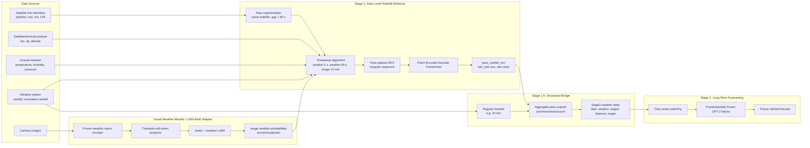
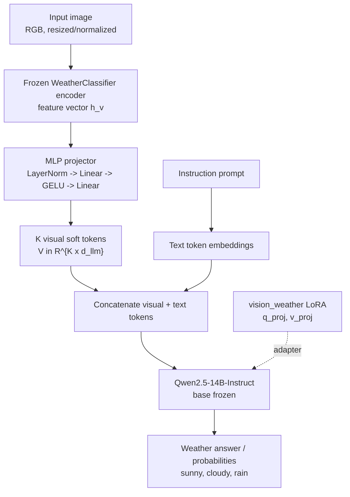
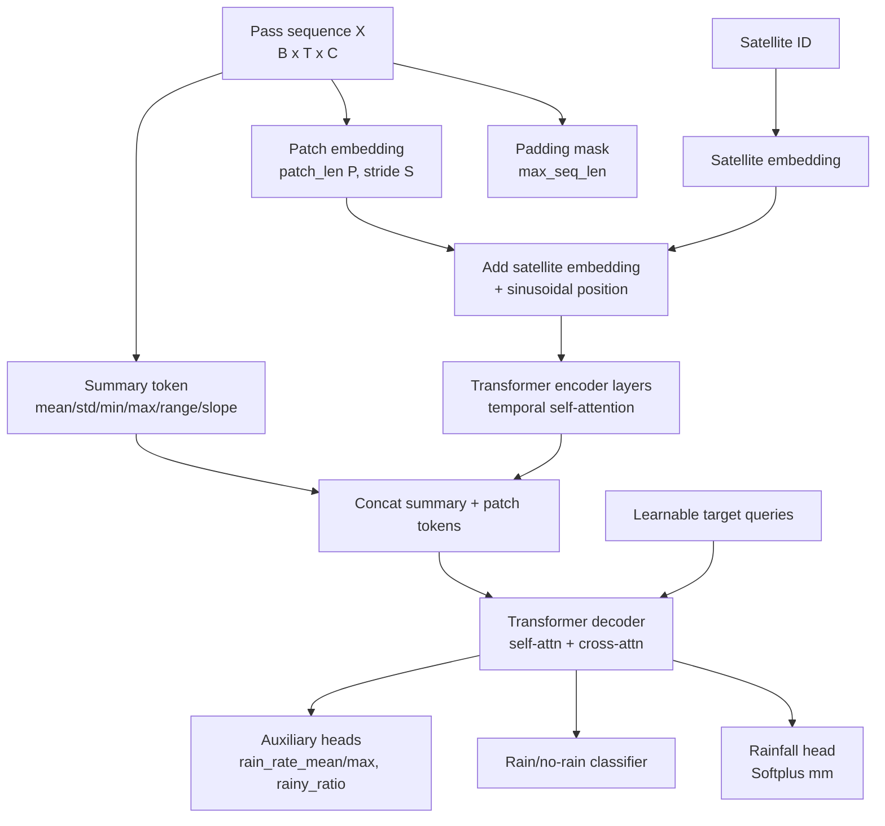
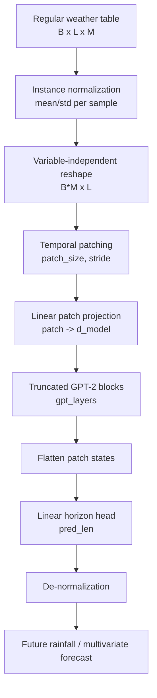

# Methodology: Satellite-Link Rainfall Retrieval and Forecasting

This section describes a three-stage framework for rainfall monitoring from low-Earth-orbit satellite link telemetry, auxiliary ground observations, camera-derived weather cues, and temporal forecasting models. The system is designed around two complementary tasks: Stage 1 retrieves rainfall during each satellite pass, while Stage 2 forecasts future rainfall on a regular time grid. Stage 1.5 bridges the two representations by aggregating pass-level retrievals into structured time-series features.

## 1. Overall Architecture

Given heterogeneous observations collected around the ground terminal, the framework converts irregular satellite passes into pass-level rainfall estimates and then injects these estimates into a regular forecasting table. Figure 1 summarizes the complete pipeline.



**Figure 1.** End-to-end architecture. Stage 1 performs rainfall retrieval on irregular satellite passes. The visual weather module supplies image-derived weather probabilities; the LoRA-MoE path is the parameter-efficient multimodal adapter built on top of the same visual encoder. Stage 1.5 turns pass-level retrievals into regular time-series features. Stage 2 performs temporal forecasting.

## 2. Problem Formulation

Let a satellite pass be an irregular sequence

\[
\mathcal{P}_i = \{(\mathbf{x}_{i,t}, m_{i,t})\}_{t=1}^{T_i},
\]

where \(T_i\) is the number of valid telemetry samples, \(m_{i,t}\in\{0,1\}\) is the padding mask, and \(\mathbf{x}_{i,t}\in\mathbb{R}^{C}\) concatenates link, geometric, ground-weather, visual-weather, and optional dry-baseline features. The Stage 1 target is pass-integrated rainfall

\[
y_i^{rain} =
\max\left(
R_{\mathrm{cum}}(t_i^{end}) - R_{\mathrm{cum}}(t_i^{start}), 0
\right),
\]

where \(R_{\mathrm{cum}}\) is the daily cumulative rainfall reported by the weather station and linearly interpolated at pass boundaries. Instantaneous rainfall is not used as the primary target because it is noisier; instead, summary quantities such as mean rain rate, maximum rain rate, and rainy ratio are used as auxiliary supervision.

Stage 2 receives a regular multivariate time series

\[
\mathbf{z}_{1:L} = [\mathbf{z}_1,\ldots,\mathbf{z}_L], \quad
\mathbf{z}_t \in \mathbb{R}^{M},
\]

and predicts rainfall over a future horizon \(H\):

\[
\hat{\mathbf{y}}_{L+1:L+H} = f_{\theta}(\mathbf{z}_{1:L}).
\]

## 3. Visual Weather Adapter with LoRA-MoE

The visual module provides weather context for Stage 1. In the current end-to-end Stage 1 workflow, camera images are passed through an existing weather classifier to export timestamped probabilities \((p_{\mathrm{sunny}},p_{\mathrm{cloudy}},p_{\mathrm{rain}})\). In parallel, the LoRA-MoE prototype implements a parameter-efficient multimodal adaptation route built on the same weather encoder:

1. A pretrained weather classifier is frozen and used as an image encoder.
2. A trainable MLP projector maps the visual feature vector to a short sequence of soft tokens.
3. A Qwen language model is frozen except for a task-specific LoRA adapter injected into attention projection matrices.
4. The model produces Chinese weather recognition responses, while the frozen weather classifier remains available for direct probability export used by Stage 1 data construction.



**Figure 2.** Visual weather adapter. The implementation is the first expert-adapter route of the broader LoRA-MoE design. It keeps the vision encoder and LLM backbone stable while training only the projector and LoRA parameters. Stage 1 can either consume classifier probabilities directly or consume outputs produced through this adapter route.

For a frozen visual encoder \(g_v\), the image feature is

\[
\mathbf{h}_v = g_v(\mathbf{I}).
\]

The projector \(p_\phi\) maps \(\mathbf{h}_v\) to \(K\) soft tokens:

\[
\mathbf{V}=p_\phi(\mathbf{h}_v)\in\mathbb{R}^{K\times d_{\mathrm{llm}}}.
\]

LoRA modifies selected linear projections in the LLM as

\[
W' = W + \frac{\alpha}{r}BA,
\]

where \(W\) is frozen, \(A\in\mathbb{R}^{r\times d}\), \(B\in\mathbb{R}^{d'\times r}\), \(r\) is the LoRA rank, and \(\alpha\) is the scaling coefficient. This restricts task-specific learning to a small set of parameters and preserves the language model's general ability.

## 4. Stage 1: Pass-Level Rainfall Retrieval

### 4.1 Pass Construction and Labeling

The Stage 1 dataset is built from SQLite database tables and camera-derived visual labels. Link telemetry is grouped by satellite ID and split into passes when adjacent samples are separated by more than 60 seconds. Passes shorter than 10 valid link samples are discarded.

For each link timestamp, position data are aligned by nearest-neighbor matching within 5 seconds. Ground weather features are aligned within 60 seconds. Image weather probabilities are matched to the pass center within a configurable tolerance, currently 10 minutes. Each valid pass stores:

\[
\mathbf{x}_{t} =
[
\mathbf{x}^{link}_{t},
\mathbf{x}^{pos}_{t},
\mathbf{x}^{weather}_{t},
\mathbf{x}^{image}_{t},
\mathbf{x}^{dry}_{t}
],
\]

where the recommended workflow uses four link channels, six position channels, three ground-weather channels, four image-weather channels, and four dry-baseline link-delta channels.

The dry baseline is computed only from dry training passes to avoid label leakage. For each satellite, dry link statistics estimate a clear-sky reference \(\bar{\mathbf{x}}^{link}_{s,dry}\), and the model receives

\[
\mathbf{x}^{dry}_{t} =
\mathbf{x}^{link}_{t} - \bar{\mathbf{x}}^{link}_{s,dry}.
\]

If a satellite has no dry training reference, the global dry baseline is used as fallback.

### 4.2 Patch Encoder-Decoder Transformer

Stage 1 uses a pass-based Patch Encoder-Decoder Transformer. It supports two encoder variants: channel-mixing and channel-wise two-stage attention. The current recommended rainfall-retrieval workflow uses the channel-mixing encoder with a summary token.



**Figure 3.** Stage 1 retrieval model. Irregular pass sequences are padded, converted into overlapping patches, encoded with satellite-aware temporal attention, and decoded through learnable target queries.

For channel-mixing patching, a window of length \(P\) is flattened and projected:

\[
\mathbf{e}_n =
\mathrm{LN}\left(
W_p \cdot
\mathrm{vec}(\mathbf{x}_{n:n+P-1})
\right).
\]

The patch sequence is augmented with a satellite embedding \(\mathbf{s}_i\) and sinusoidal positional encoding:

\[
\tilde{\mathbf{e}}_n = \mathbf{e}_n + W_s\mathbf{s}_i + \mathrm{PE}(n).
\]

The optional channel-wise encoder first embeds each feature group independently:

\[
\mathbf{E}\in\mathbb{R}^{N\times G\times d},
\]

then applies temporal attention within each group and channel attention across feature groups at each patch index:

\[
\mathbf{E}'_{:,g}=\mathrm{Attn}_{time}(\mathbf{E}_{:,g}), \quad
\mathbf{E}''_{n,:}=\mathrm{Attn}_{channel}(\mathbf{E}'_{n,:}).
\]

A pass summary token is computed from masked statistics:

\[
\mathbf{u} =
\mathrm{MLP}\left(
[\mu,\sigma,\min,\max,\mathrm{range},\mathrm{slope}]
\right),
\]

and prepended to encoded patch tokens. Decoder target queries attend to the encoded pass representation. The rainfall head outputs a nonnegative physical rainfall value:

\[
\hat{y}^{rain}=\mathrm{Softplus}(W_r\mathbf{q}_r+b_r),
\]

and a separate classifier predicts rain occurrence.

### 4.3 Objective

The rainfall regression loss is computed in physical millimeters using Smooth L1 loss. Rainy samples are up-weighted to handle severe class imbalance:

\[
\mathcal{L}_{rain}
=
\frac{1}{B}\sum_{i=1}^{B}
\left(1+\lambda_{rainy}\mathbb{1}[y_i^{rain}>\tau]\right)
\mathrm{SmoothL1}(\hat{y}_i^{rain},y_i^{rain}).
\]

The classification term is binary cross entropy with positive-class weighting:

\[
\mathcal{L}_{cls}
=
\mathrm{BCEWithLogits}(\hat{c}_i,\mathbb{1}[y_i^{rain}>\tau]).
\]

When auxiliary targets are enabled, the model also predicts instantaneous-rain summaries. The full loss is

\[
\mathcal{L}
=
\lambda_r\mathcal{L}_{rain}
+\lambda_c\mathcal{L}_{cls}
+\lambda_a\mathcal{L}_{aux}.
\]

Training uses AdamW, cosine learning-rate scheduling, early stopping on validation loss, and a weighted sampler that increases the frequency of rainy passes during minibatch construction.

## 5. Stage 1.5: Pass-to-Series Bridge

Stage 1.5 converts irregular pass-level retrievals into a regular time-series table compatible with Stage 2. Weather-station data are resampled into right-labeled buckets such as 10 minutes. The target is fixed-window rainfall:

\[
y_t =
\max\left(
R_{\mathrm{cum}}(t)-R_{\mathrm{cum}}(t-\Delta),0
\right).
\]

Stage 1 pass outputs are assigned to buckets by pass end time, using ceiling alignment so a pass ending at 11:34 contributes to the 11:40 bucket for a 10-minute table. The bridge exports statistics such as:

\[
\mathrm{sum}(\hat{y}^{rain}),\quad
\mathrm{mean}(\hat{y}^{rain}),\quad
\mathrm{max}(\hat{y}^{rain}),\quad
\mathrm{pass\_count},\quad
\mathrm{has\_pass}.
\]

The resulting CSV follows the GPT4TS custom dataset format:

```text
date, weather features, Stage1 retrieval features, target rainfall
```

This design separates retrieval from forecasting: Stage 1 estimates rainfall from satellite-link physics during overpasses, while Stage 2 learns temporal evolution from regular meteorological and retrieval-derived features.

## 6. Stage 2: GPT4TS Forecasting

Stage 2 uses the long-term forecasting implementation of GPT4TS. For an input sequence \(\mathbf{z}_{1:L}\in\mathbb{R}^{L\times M}\), variables are processed independently by rearranging the tensor into \(B\cdot M\) univariate sequences. Each sequence is normalized, padded, and split into overlapping temporal patches:

\[
\mathbf{p}_{m,n} =
[z_{m,nS},\ldots,z_{m,nS+P-1}].
\]

Each patch is projected into the GPT hidden dimension:

\[
\mathbf{h}_{m,n}=W_{in}\mathbf{p}_{m,n}+b_{in}.
\]

The patch embeddings are passed through the first \(L_g\) GPT-2 transformer blocks. During parameter-efficient forecasting, most GPT-2 parameters are frozen, while layer normalization and positional embeddings can remain trainable. The output layer maps the flattened hidden states to the prediction horizon:

\[
\hat{\mathbf{y}}_{m,1:H}
=
W_{out}\mathrm{vec}([\mathbf{h}_{m,1},\ldots,\mathbf{h}_{m,N}])+b_{out}.
\]

Finally, predictions are de-normalized using the input sequence statistics.



**Figure 4.** GPT4TS-based Stage 2 forecasting. Stage 1.5 features are treated as regular time-series variables and fed into a patch-based GPT forecaster.

## 7. Train/Validation/Test Protocol

The Stage 1 workflow first builds a timestamped NPZ dataset, then trains and evaluates the retrieval model. The split ratio is \(0.7/0.2/0.1\). Two validation strategies are implemented:

- `stratified_all`: rainy and dry passes are separately shuffled and split, which gives all splits rainy examples and is useful for model diagnosis under rare rainfall.
- `stratified_before_test`: the last 10% of time remains the test set, while train/validation are stratified within the preceding 90%; this better approximates online deployment.

All scalers, satellite ID mappings, and dry-baseline references are fitted from the training split only. Checkpoints store model configuration, feature scalers, target scalers, and satellite mapping for reproducible inference.

For online use, the feature-construction path must match training exactly: satellite pass segmentation, timestamp alignment tolerances, image-weather matching, dry-baseline construction, feature order, normalization, and satellite ID mapping. The unknown satellite slot supports cold-start satellites, while constellation growth can be handled by increasing the embedding table and retraining or fine-tuning periodically.

## 8. Implementation Summary

The main implementation files are:

| Component | Files |
| --- | --- |
| Stage 1 workflow | `Stage1/model/scripts/run_rain_retrieval_workflow.sh` |
| Stage 1 dataset construction | `Stage1/model/data/preprocessing.py`, `Stage1/model/data/data_factory.py` |
| Stage 1 model | `Stage1/model/models/patch_encoder_decoder.py` |
| Stage 1 evaluation | `Stage1/model/scripts/evaluate_checkpoint_splits.py` |
| Visual LoRA adapter | `MoE/lora-moe/src/lora_moe/components.py`, `MoE/lora-moe/src/lora_moe/train/vision_weather_lora.py` |
| Stage 1.5 bridge | `Stage1.5/build_stage2_weather_table.py` |
| Stage 2 forecasting | `Stage2/GPT4TS/Long-term_Forecasting/models/GPT4TS.py` |

Rendered SVG figures are stored under `docs/figures/`, with matching Mermaid source files for later editing.
